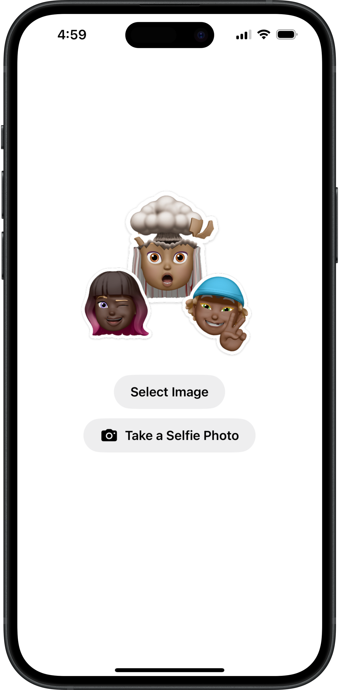
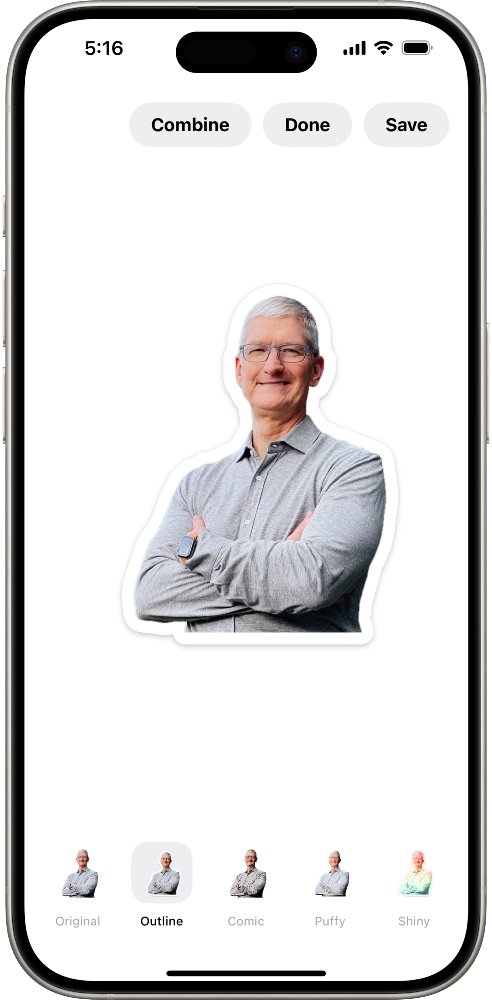

# StickerFace

  
  
  

 

StickerFace is a minimal SwiftUI app for turning photos and selfies into sticker-style cutouts with iOS effects.

  
  

## Features

- Select an image or take a selfie.
- Remove the background from people and faces.
- Apply Original, Outline, Comic, Puffy, and Shiny effects.
- Combine effects and save the finished sticker.

## Requirements

- iOS 17+
- Xcode 16+
- Swift 5

## Getting Started

1. Clone the repository.
2. Open `StickerMaker.xcodeproj` in Xcode.
3. Build and run on an iOS device or simulator.

## Note

Sticker effects are powered by VisionKitCore APIs.

## License

MIT
